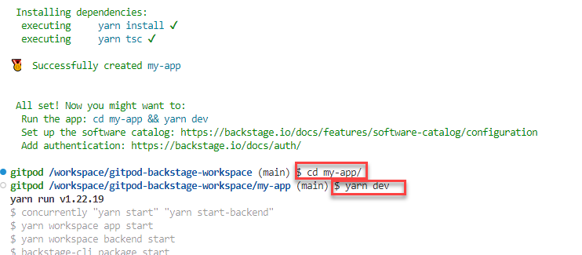

# gitpod-backstage-workspace

Based on [this tutorial Standing up Backstage](https://backstage.spotify.com/learn/standing-up-backstage/standing-up-backstage/1-intro/), the steps for creating a Backstage App are:

In a terminal, execute this command:

```
npx @backstage/create-app
```

answer `y` to *Ok to proceed? (y)*

Enter a name for the app. In this example I have used `my-app`.

  

Wait for the yarn-install to complete (100-150 seconds). A new directory my-app is created. The new Backstage app is created in this directory.

Change into this directory and run `yarn dev`:

```
cd my-app
yarn dev
```

  
The Backstage app will start both the backend and frontend app. When the terminal shows the line *[0] Webpack compiled successfully*, the Backstage app will be ready. You can then access the Backspace app at http://localhost:3000/.  

  

_Note_: this will work from VS Code Desktop (local terminal) - with local port forwarding. Not when running in the browser based environment: Backstage access. Also note that the Backstage frontend app accesses the backend API at port 7007. That means that this port must both be forwarded *and* made public. 

  

You should find your Developer Portal in good working order. Explore around - see what it has to offer in its bare, default form. 

  

For example:
* [the Tech Radar](http://localhost:3000/tech-radar) 
* [a sample API component](http://localhost:3000/catalog/default/api/example-grpc-api)
* [a sample Web Site component](http://localhost:3000/catalog/default/component/example-website)

Then you could start extending and fine tuning. Add some plugins, change the configuration of the portal as it currently stands.

See for example: [Configuring Plugins](https://backstage.io/docs/getting-started/configure-app-with-plugins)

### Onboarding software to Backstage

You may now want to work your way through this tutorial: [Onboarding Software to Backstage](https://backstage.spotify.com/learn/onboarding-software-to-backstage/)


## Tutorials for installing and trying out Backstage

Instead of locally installing & running Backage, you can try out Backstage in the public demo environment: https://demo.backstage.io/catalog?filters%5Bkind%5D=component&filters%5Buser%5D=owned 

Introduction Backstage for All - concepts, objectives, terminology: 
https://backstage.spotify.com/learn/backstage-for-all/backstage-for-all/1-introduction/

Onboarding software to Backstage: https://backstage.spotify.com/learn/onboarding-software-to-backstage/

## Supporting Materials

Medium article - [Backstage by Example (Part 1)](https://john-tucker.medium.com/backstage-by-example-part-1-a18e74849240)

Standing up Backstage (creating your first app) - https://backstage.spotify.com/learn/standing-up-backstage/standing-up-backstage/1-intro/

[Backstage Documentation](https://backstage.io/docs/overview/what-is-backstage)

